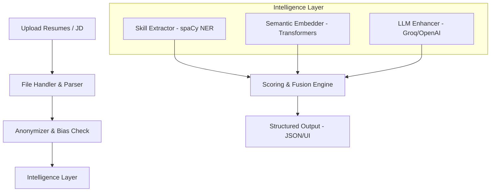

# 📄 Hybrid Resume Screener AI

### *Modernizing Talent Acquisition with Semantic Intelligence & Bias Mitigation*

Welcome to the **Hybrid Resume Screener AI**—a state-of-the-art solution designed to bridge the gap between simple keyword matching and deep semantic understanding. Built on the principles of hybrid AI frameworks, this system analyzes resumes (PDF, DOCX, TXT) not just for what they say, but for what they *mean*.

---

## ✨ Key Features

- **🧠 Hybrid Scoring Engine**: Combines Hard-Skill Extraction (exact matching) with Semantic Embeddings (contextual matching) and LLM Reasoning (soft-skill analysis).
- **📑 Layout-Aware Parsing**: Handles multi-column resumes, tables, and complex headers using `pdfplumber` and `fitz`.
- **🛡️ Bias Mitigation**: Automatically redacts sensitive information (emails, phones, gender proxies) before analysis to ensure a fair screening process.
- **📈 Comprehensive Breakdown**: Provides an "Overall Match" score alongside matched skills, missing skills, and a human-readable explanation.
- **🎨 Premium UI**: A sleek, human-centered Streamlit dashboard designed for ease of use by HR professionals.

---

## 🏗️ Architecture



---

## 🚀 Quick Start

### 1. Prerequisites
- Python 3.9+
- A [Groq API Key](https://console.groq.com/) (optional, for soft-skill reasoning)

### 2. Installation
Clone the repo and run the setup script:
```bash
# Clone the repository
git clone https://github.com/Hamzakhan0332/Hybrid-resume-screener-Ai.git
cd Hybrid-resume-screener-Ai

# Run automated setup (Windows)
setup.bat

# OR manual setup
pip install -r requirements.txt
python -m spacy download en_core_web_md
```

### 3. Environment Setup
Create a `.env` file in the root directory:
```env
GROQ_API_KEY=your_key_here
LLM_PROVIDER=groq # or openai
```

---

## 💻 Usage

### **Web Dashboard (Recommended)**
Experience the full premium interface:
```bash
streamlit run streamlit_app.py
```

### **CLI Mode**
For quick batch processing or integration:
```bash
python app.py --resume path/to/cv.pdf --jd path/to/jd.txt
```

---

## 📂 Project Structure

```text
resume_screener/
├── ingest/          # Document parsing (PDF, DOCX, TXT)
├── extract/         # NLP, NER, and Skill Extraction logic
├── match/           # Semantic matching & LLM enhancement
├── output/          # Bias check & Pydantic formatters
├── app.py           # CLI Entry point
├── streamlit_app.py # Web Dashboard
└── requirements.txt # Project dependencies
```

---

## 🛠️ Technology Stack

- **NLP**: `spaCy` (NER), `Sentence-Transformers` (Embeddings)
- **Document Processing**: `pdfplumber`, `PyMuPDF`, `python-docx`
- **Inference**: `Groq Cloud` (Llama 3) / `OpenAI`
- **UI**: `Streamlit`
- **Data Integrity**: `Pydantic`

---

## 🤝 Evaluation & Testing
To test the system effectively, we recommend using the included `sample_resume.txt` and `sample_jd.txt`. You can also download the **Kaggle Resume Dataset** for large-scale evaluation.

---

## 📜 License
Distributed under the MIT License. See `LICENSE` for more information.

*Built with ❤️ by the Antigravity AI Team.*
